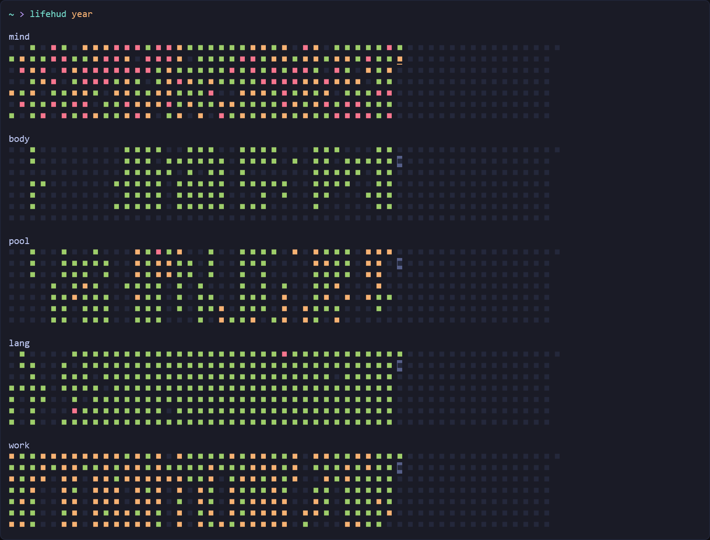

# LifeHUD
Visualize progress on life projects in the form of contribution graphs.

## Why?
Initially popularized by version control sites like Github and Gitlab, the so-called "contribution graph" has a number of features that make it a deceptively powerful tool for visualizing past progress (and motivating future progress) on long-term life projects.

- Words.
- More words...

## History
- `yyyy-mm-dd` v1.0.0.
- `2023-09-03` Initial dev.
- `2023-04-18` [Ideation](_arc/ideation.md).
